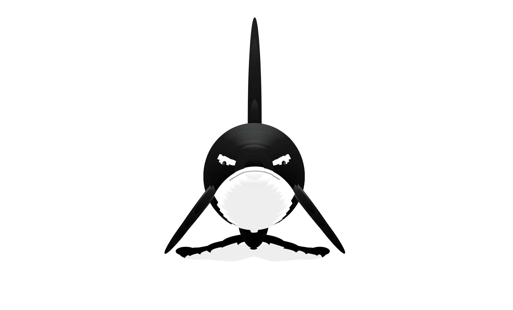

# Orca Project

An interactive Orca whale animation project using HTML5, CSS JavaScript and jQuery.
This was a side project for me while being a talent at Zone01 Oujda




## Description

This project creates an interactive orca whale animation that responds to user interactions in the browser. The whale moves smoothly across the screen and provides a delightful user experience.

## Installation

1. Clone the repository:
```bash
git clone https://github.com/ibentour/Orca-Project.git
```

2. Navigate to the project directory:
```bash
cd Orca-Project
```

## Usage

Simply open `interactive-orca.html` in your web browser to view the animation.

## Project Structure

```
Orca-Project/
├── interactive-orca.html    # Main HTML file
├── interactive-orca.css     # Styling for the animation
├── jquery-orca.js          # jQuery library
├── orca.js                 # Main animation logic
└── README.md               # This file
```

## Features

- Smooth whale animation
- Interactive movement
- Responsive design
- Cross-browser compatibility